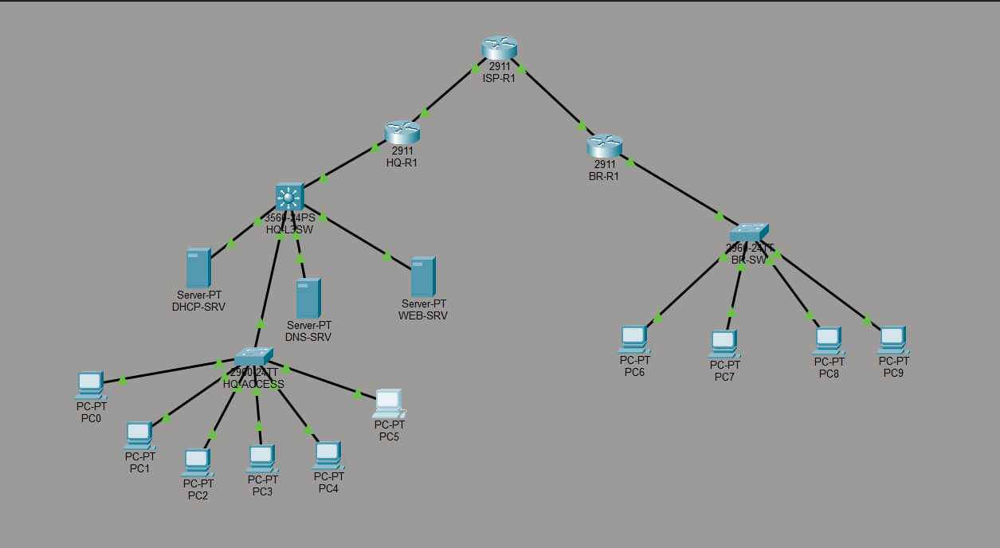
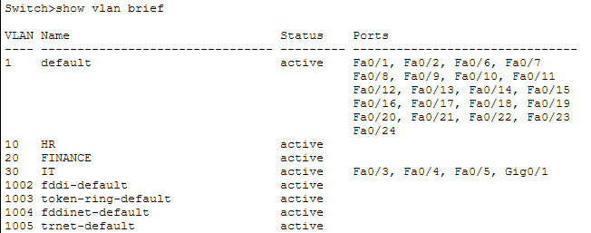
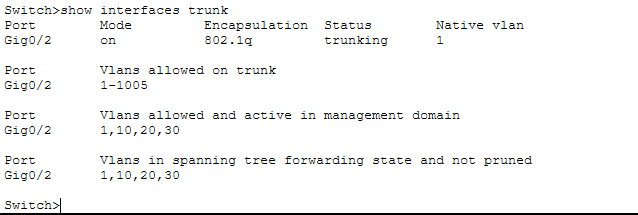
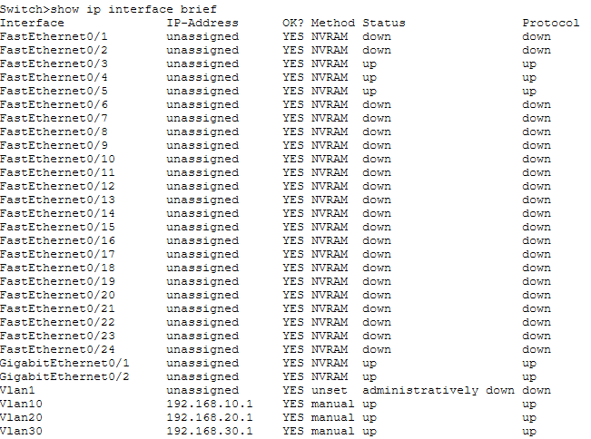
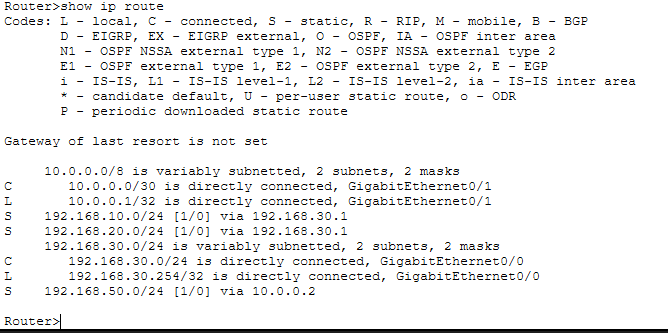
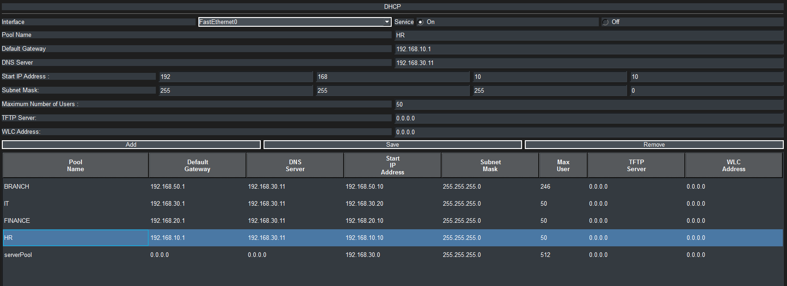
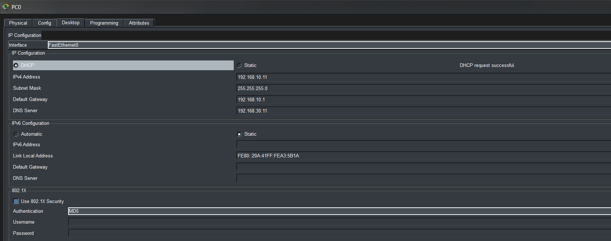
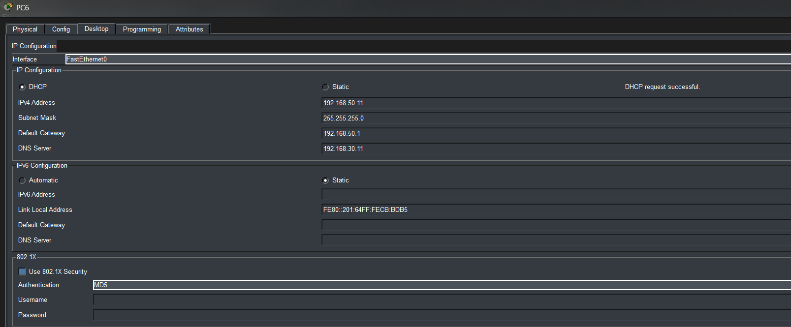
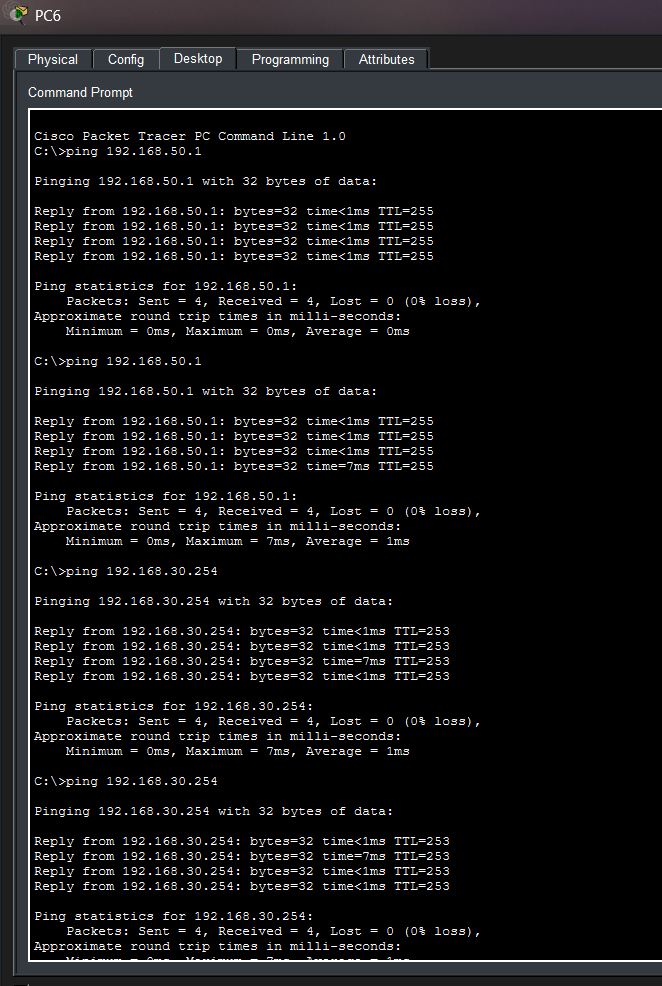
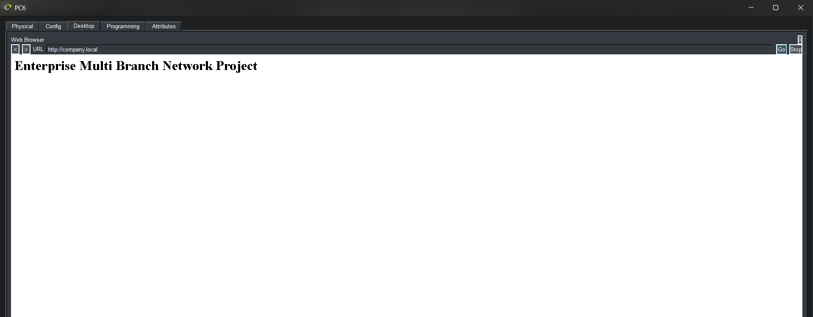

# Enterprise-Multi-Site-Network-Lab

A simulated **enterprise multi-site network architecture** built using Cisco Packet Tracer.

This project demonstrates how a headquarters network connects to a remote branch through an ISP backbone while providing centralized network services such as DHCP, DNS, and Web hosting.

---

# Network Overview

The simulated enterprise infrastructure consists of:

**Headquarters (HQ)**

* Layer-3 switch for inter-VLAN routing
* Access switch for client devices
* DHCP Server
* DNS Server
* Web Server

**Branch Office**

* Branch router
* Access switch
* Client PCs

**ISP Backbone**

* Router acting as the service provider connecting HQ and Branch.

---

# Network Topology



This topology connects the branch network to headquarters through an ISP router while maintaining segmented VLAN networks inside HQ.

---

# VLAN Architecture

The headquarters network uses VLAN segmentation.

| VLAN    | Department   | Gateway      |
| ------- | ------------ | ------------ |
| VLAN 10 | HR           | 192.168.10.1 |
| VLAN 20 | Finance      | 192.168.20.1 |
| VLAN 30 | IT / Servers | 192.168.30.1 |

The Layer-3 switch performs **inter-VLAN routing using SVI interfaces**.

---

# Switch VLAN Configuration



This output verifies that VLAN segmentation is correctly configured across the switch ports.

---

# Trunk Link Verification



The trunk link allows VLAN traffic to pass between the access switch and the Layer-3 switch.

---

# Interface Status



This confirms that all active interfaces and VLAN interfaces are operational.

---

# Routing Architecture

Static routing is used to allow communication between HQ, ISP, and the branch network.



This ensures that each network knows how to reach remote networks.

---

# DHCP Architecture

A centralized DHCP server located in VLAN 30 dynamically assigns IP addresses to all networks.

Branch clients obtain IP addresses using **DHCP relay (ip helper-address)**.



---

# Client IP Configuration

### HQ Client



### Branch Client



Both clients successfully receive IP addresses from the DHCP server.

---

# Network Connectivity Tests

End-to-end connectivity was verified using ICMP ping tests.



This confirms:

* Branch ↔ HQ connectivity
* Routing through ISP
* DHCP server reachability
* DNS resolution

---

# Web Server Access



The internal web server is reachable through the domain:

```
http://company.local
```

---

# Configuration Files

All device configurations are included in the **configs/** directory.

```
configs/
 ├ access-switch.txt
 ├ l3-switch.txt
 ├ hq-router.txt
 ├ branch-router.txt
 └ isp-router.txt
```

These files contain the full running configuration for each device.

---

# Repository Structure

```
enterprise-multibranch-network-lab
│
├ enterprise-network.pkt
├ README.md
│
├ screenshots
│   ├ topology.png
│   ├ vlan-config.png
│   ├ trunk.png
│   ├ interface-status.png
│   ├ routing-table.png
│   ├ dhcp-pools.png
│   ├ pc0-ip.png
│   ├ pc6-ip.png
│   ├ ping-test.png
│   └ webpage.png
│
└ configs
    ├ access-switch.txt
    ├ l3-switch.txt
    ├ hq-router.txt
    ├ branch-router.txt
    └ isp-router.txt
```

---

# Skills Demonstrated

* VLAN configuration
* Layer-3 switching
* DHCP relay configuration
* Static routing
* DNS and web service deployment
* Multi-site enterprise network design
* Network troubleshooting using CLI

---

## Troubleshooting Notes

During the implementation of this network simulation several configuration issues were encountered and resolved. Initially, DHCP requests from HQ clients failed because VLAN interfaces on the Layer-3 switch were not forwarding DHCP broadcasts. This was diagnosed by checking interface status and VLAN configuration using commands such as `show ip interface brief` and `show vlan brief`. The issue was resolved by adding DHCP relay (`ip helper-address`) on the relevant VLAN interfaces so that DHCP requests could reach the centralized DHCP server.

Another issue occurred with branch clients where PC6 could not obtain an IP address. After verifying routing and interface connectivity, the problem was traced to the Branch router configuration. Adding the DHCP relay command on the branch router interface successfully allowed DHCP requests to reach the HQ DHCP server.

Additional troubleshooting involved verifying trunk links and routing tables between HQ, ISP, and Branch routers using commands like `show interfaces trunk` and `show ip route`. These diagnostic steps ensured proper VLAN communication and full connectivity between all networks.

---

# Tools Used

* Cisco Packet Tracer
* Cisco IOS CLI
* GitHub

---

# Author

Akshay Kumar
